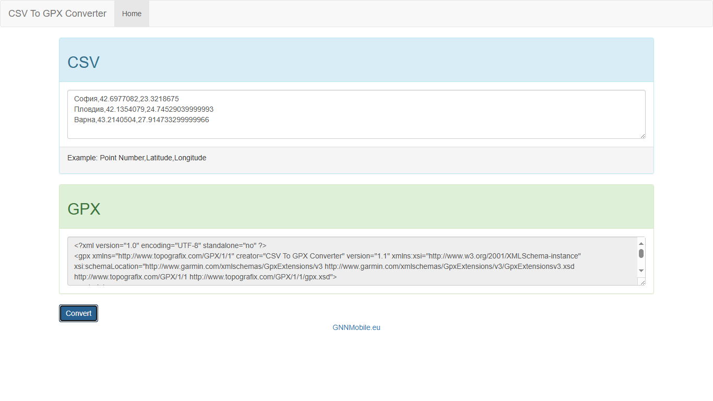

# CSV To GPX Converter

 Simple CSV to GPX converter written in plain JavaScript.

 

## Usage

### Input

```
point 1,latitude1,longitude2
point 2,latitude2,longitude2
...
point n,latituden,longituden
```

### Output

Text formatted as GPX.

## Project Page

[CSV To GPX Converter](https://gnnmobile.eu/%d0%bf%d1%80%d0%be%d0%b5%d0%ba%d1%82%d0%b8/javascript/csv-gpx-converter)

## License

[MIT](https://choosealicense.com/licenses/mit/)
